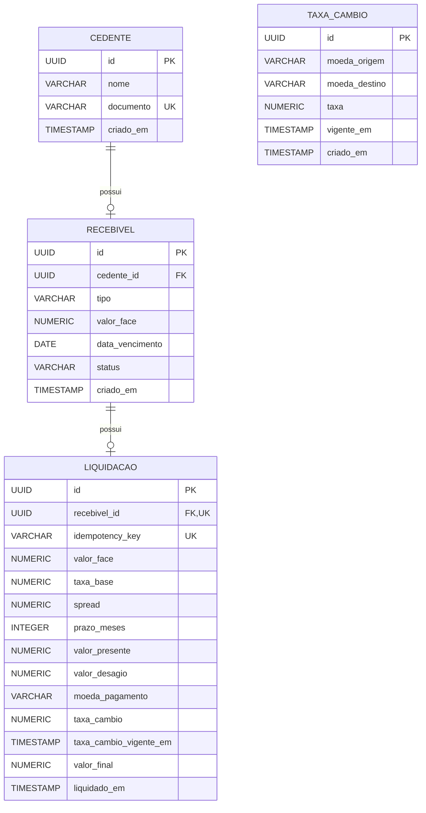

# SRM Credit Engine

Plataforma para cadastro, precificação, liquidação e consulta de recebíveis com suporte a pagamentos em BRL e USD.

O projeto foi desenvolvido para o desafio técnico da SRM, priorizando corretude financeira, clareza de código, idempotência, auditabilidade e integração ponta a ponta entre backend e frontend.

## Funcionalidades

- cadastro de cedentes;
- cadastro de recebíveis;
- cadastro manual de taxas de câmbio;
- simulação de precificação;
- liquidação em BRL ou USD;
- retry idempotente de liquidação;
- extrato com filtros por período, cedente e moeda;
- documentação da API com Swagger/OpenAPI.

## Stack

### Backend

- Java 21
- Spring Boot
- Spring MVC
- Spring Data JPA / Hibernate
- Bean Validation
- PostgreSQL
- Lombok
- Springdoc / OpenAPI
- Maven

### Frontend

- React
- TypeScript
- Vite

## Estrutura

```text
DesafioTecnico-SRM/
├── backend/
│   └── creditengine/
├── frontend/
├── SPEC.md
├── DECISIONS.md
├── REVIEW.md
├── AI_USAGE.md
└── README.md
```

No backend, as principais responsabilidades estão separadas em:

```text
controller
service
repository
model
dto
strategy
exception
```

## Modelo de dados

O projeto utiliza PostgreSQL com um modelo relacional simples.



`TaxaCambio` não possui relacionamento direto com `Liquidacao`. A liquidação armazena um snapshot da taxa e de sua vigência utilizadas na operação, preservando a auditabilidade mesmo que novas taxas sejam cadastradas depois.

## Regras principais

A precificação utiliza:

```text
VP = VF / (1 + taxaBase + spread) ^ prazo
```

Premissas implementadas:

- taxa base: `1% a.m.`;
- Duplicata Mercantil: spread `1,5% a.m.`;
- Cheque Pré-datado: spread `2,5% a.m.`;
- valores financeiros com `BigDecimal`;
- cálculos intermediários com `DECIMAL128`;
- arredondamento monetário com `HALF_EVEN`;
- pagamento em USD convertido somente após o cálculo do valor presente em BRL;
- taxa cambial mais recente cuja vigência seja menor ou igual ao instante da operação.

As premissas completas estão em [`SPEC.md`](./SPEC.md).

## Golden cases

Os casos obrigatórios do desafio possuem testes automatizados:

| Caso | Tipo | Valor de face | Prazo | Resultado esperado |
| --- | --- | ---: | ---: | ---: |
| C1 | Duplicata | R$ 100.000,00 | 3 meses | R$ 92.859,94 |
| C2 | Cheque | R$ 25.000,00 | 2 meses | R$ 23.337,77 |
| C3 | Duplicata / USD | R$ 100.000,00 | 3 meses | US$ 17.094,67 |

No C3 é utilizada a taxa BRL/USD `5,4321`.

## Idempotência

O endpoint de liquidação exige o header:

```http
Idempotency-Key
```

Comportamento:

- nova operação → `201 Created`;
- retry da mesma operação com a mesma chave → `200 OK`, sem nova liquidação;
- mesma chave usada em outra operação → `409 Conflict`;
- tentativa de liquidar novamente um recebível já liquidado → `409 Conflict`.

A persistência também possui restrições de unicidade para a chave idempotente e para o recebível associado à liquidação.

## Auditabilidade

Cada liquidação grava um snapshot dos dados usados na operação, incluindo:

- valor de face;
- taxa base;
- spread;
- prazo;
- valor presente;
- deságio;
- moeda de pagamento;
- taxa de câmbio utilizada;
- vigência da taxa;
- valor final;
- data/hora da liquidação.

A API não expõe operações de atualização ou exclusão de liquidações.

## Como rodar

### Pré-requisitos

- Java 21
- Maven
- PostgreSQL
- Node.js 20.19+ ou 22.12+
- npm

### Backend

Entre na pasta:

```bash
cd backend/creditengine
```

Crie um arquivo `.env` nessa pasta com:

```env
PGHOST=seu-host
PGDATABASE=seu-banco
PGUSER=seu-usuario
PGPASSWORD=sua-senha
PGSSLMODE=require
```

A aplicação lê essas variáveis no `application.properties`.

Execute:

```bash
mvn spring-boot:run
```

Por padrão:

```text
API:     http://localhost:8080
Swagger: http://localhost:8080/swagger-ui/index.html
```

### Testes do backend

```bash
mvn clean test
```

O conjunto atual cobre:

- golden cases C1, C2 e C3;
- busca e conversão cambial;
- ausência de taxa vigente;
- liquidação em BRL;
- liquidação em USD;
- retry idempotente;
- reutilização incompatível de `Idempotency-Key`;
- tentativa de nova liquidação de recebível já liquidado.

### Frontend

Entre na pasta:

```bash
cd frontend
```

Instale as dependências:

```bash
npm install
```

Crie um `.env` a partir do `.env.example`:

```env
VITE_API_BASE_URL=/
```

No ambiente de desenvolvimento, as chamadas usam caminhos relativos e passam pelo proxy configurado no Vite para o backend local.

Depois execute:

```bash
npm run dev
```

Para validar o build:

```bash
npm run build
```

## Fluxo de uso

Um fluxo típico é:

```text
1. cadastrar cedente
2. cadastrar recebível
3. cadastrar taxa BRL/USD, se necessária
4. simular a precificação
5. liquidar o recebível
6. consultar o extrato
```

O frontend não executa regras financeiras. Ele envia os dados para a API e apresenta o resultado calculado pelo backend.

## Principais endpoints

```text
GET    /api/cedentes
POST   /api/cedentes

GET    /api/recebiveis
GET    /api/recebiveis/{id}
POST   /api/recebiveis

POST   /api/precificacoes/simular

POST   /api/taxas-cambio
GET    /api/taxas-cambio/vigente

POST   /api/recebiveis/{recebivelId}/liquidacoes
GET    /api/liquidacoes
```

O extrato aceita filtros opcionais:

```text
dataInicio
dataFim
cedenteId
moeda
```

## Decisões de escopo

A implementação foi mantida propositalmente simples.

Itens como Docker, optimistic locking, observabilidade, circuit breaker, paginação server-side e CI/CD não foram adicionados porque pertencem a níveis superiores do desafio ou não eram necessários para o escopo atual.

As decisões e cortes estão detalhados em [`DECISIONS.md`](./DECISIONS.md).

## Documentação complementar

- [`SPEC.md`](./SPEC.md) — premissas, precisão, regras e critérios de aceite;
- [`DECISIONS.md`](./DECISIONS.md) — decisões técnicas e cortes de escopo;
- [`REVIEW.md`](./REVIEW.md) — code review reverso do Anexo A;
- [`AI_USAGE.md`](./AI_USAGE.md) — como IA foi utilizada e validada durante o desenvolvimento.

## Estratégia de desenvolvimento

O desenvolvimento foi realizado utilizando branches por funcionalidade e commits pequenos e descritivos.

A prioridade foi manter um histórico fácil de revisar e explicar durante a defesa técnica, evitando alterações grandes e pouco rastreáveis.
